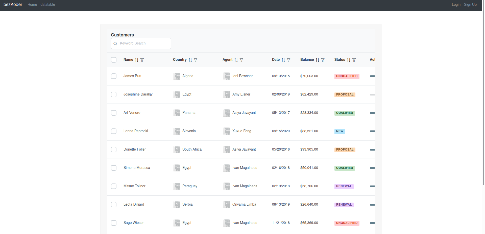

## About
This is the project forked out from the bezkoder react-jwt-authentication [github](https://github.com/bezkoder/react-jwt-auth).

The project has been integrated with the prime react components of datatable. Below are an example of the datatable that have been implemented.


The table is made up of sample data that comes from primereact example and the table is a copy of primereact datatable. There are some required files that need to be imported first so that the prime react loaded succsussfully excluding the components libraries needed. These will be imported in the App.js

```js
// primereact themes
import "primereact/resources/themes/lara-light-purple/theme.css"; 
// core css to load the prime react
import "primereact/resources/primereact.min.css";                 
// icons that can be imported
import "primeicons/primeicons.css";
```

- Other available themes can be found in [here](https://github.com/primefaces/primereact/tree/master/public/themes)
